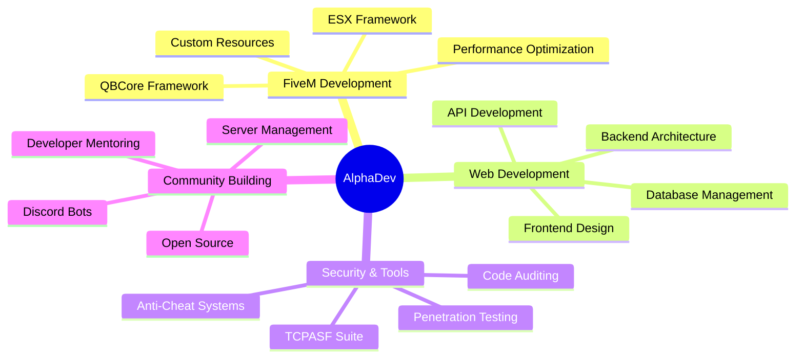

# 🚀 AlphaDev - Full-Stack Developer & FiveM Architect

<div align="center">


[](https://git.io/typing-svg)

</div>

---

## 🎯 About Me

> **21-year-old visionary developer from Algeria**, transforming ideas into premium digital experiences that power communities worldwide.

```typescript
const AlphaDev = {
    location: "Algeria 🇩🇿",
    age: 21,
    role: "Full-Stack Developer & FiveM Architect",
    languages: ["Lua", "JavaScript", "Python", "CSS", "HTML"],
    specializations: [
        "Premium FiveM Script Development",
        "Interactive UI/UX Design", 
        "Discord Bot Architecture",
        "Advanced Security Solutions"
    ],
    community: "W Development - 10K+ Members",
    motto: "Code with passion, build with purpose"
};
```

### 🌟 What Sets Me Apart

- 🎨 **Design-First Approach** — Every project starts with exceptional UI/UX
- ⚡ **Performance Obsessed** — Optimized code that scales beautifully
- 🛡️ **Security Minded** — Advanced protection with TCPASF suite
- 🤝 **Community Driven** — Building tools that empower thousands
- 🔄 **Continuous Innovation** — Always pushing the boundaries

---

## 🏆 GitHub Analytics

<div align="center">


<br/>


</div>

---

## 🚀 Featured Projects

<div align="center">

### 🌟 Premium FiveM Solutions

</div>

<table>
<tr>
<td width="50%">

### 🎮 [`alpha-menu`](https://github.com/AlphaDev/alpha-menu)
**NoPixel-Inspired Interactive Menu**
- 🎨 Fully customizable CSS themes
- ⚡ Smooth animations & transitions  
- 🔧 Plug-and-play integration
- 📱 Mobile-responsive design

```css
/* Advanced CSS Architecture */
.menu-container {
    backdrop-filter: blur(20px);
    border-radius: 12px;
    animation: slideIn 0.3s ease;
}
```

</td>
<td width="50%">

### 🏦 [`alpha-banking`](https://github.com/AlphaDev/alpha-banking)
**Next-Gen Banking System**
- 💳 QBCore deep integration
- 🔐 Advanced security protocols
- 📊 Real-time transaction tracking
- 🎯 Intuitive admin panel

```lua
-- High-Performance Lua Code
Config.Security = {
    encryption = "AES-256",
    rateLimit = 100,
    antiExploit = true
}
```

</td>
</tr>
<tr>
<td width="50%">

### 🛡️ [`tcpasf-tool`](https://github.com/AlphaDev/tcpasf-tool)
**Advanced Security Suite**
- 🔍 Real-time threat detection
- 🛡️ Anti-cheat mechanisms
- 📈 Performance monitoring  
- 🚨 Automated incident response

```python
# AI-Powered Security
class ThreatDetector:
    def analyze_patterns(self):
        return self.ml_engine.detect_anomalies()
```

</td>
<td width="50%">

### 🤖 [`Advanced-Discord-Bot`](https://github.com/AlphaDev/Advanced-Discord-Bot-by-AlphaDev)
**Enterprise Discord Solution**
- 🎯 Advanced moderation tools
- 🎮 Interactive games & activities
- 📊 Analytics dashboard
- 🔧 Custom command framework

```javascript
// Scalable Architecture
class BotFramework extends EventEmitter {
    constructor() {
        super();
        this.loadModules();
    }
}
```

</td>
</tr>
</table>

<div align="center">

### 🏗️ Additional Innovations

| Project | Category | Tech Stack | Status |
|---------|----------|------------|--------|
| [`alpha-mission`](https://github.com/AlphaDev/alpha-mission) | 🎯 Mission System | Lua + MySQL | ✅ Active |
| [`wd-bossmenu`](https://github.com/AlphaDev/wd-bossmenu) | 💼 Management | JS + CSS3 | ✅ Active |
| [`alpha-vehiclemenu`](https://github.com/AlphaDev/alpha-vehiclemenu) | 🚗 Vehicle System | Vue.js + Lua | ✅ Active |
| [`alpha-garages`](https://github.com/AlphaDev/alpha-garages) | 🏢 Storage System | React + Node | ✅ Active |

[**📂 View All Repositories →**](https://github.com/AlphaDev?tab=repositories)

</div>

---

## 🛠️ Technology Arsenal

<div align="center">

### 💻 Languages & Frameworks


### 🔧 Tools & Platforms


### 🎯 Specializations



</div>

---

## 🌍 Community Impact

<div align="center">

### 🏢 W Development Community

[](https://discord.gg/dF5C55hQYB)

</div>

- 👥 **10,000+** Active developers and roleplayers
- 🔧 **500+** Custom scripts distributed
- 🎯 **50+** Server partnerships worldwide  
- 📚 Daily tutorials and workshops
- 🤝 24/7 developer support

---

## 📊 Development Philosophy

<div align="center">

```ascii
╭─────────────────────────────────────────────╮
│  "Code is poetry written in logic"          │
│                                             │
│  ✨ Clean, readable, maintainable          │
│  🚀 Performance-first approach             │
│  🎨 User experience obsessed               │
│  🔐 Security by design                     │
│  🤝 Community-driven development           │
╰─────────────────────────────────────────────╯
```

</div>

### 🎯 Current Focus Areas

- 🔮 **AI Integration** — Implementing machine learning in FiveM scripts
- 🌐 **Web3 & Blockchain** — Exploring decentralized gaming economies  
- 📱 **Mobile Development** — React Native companion apps
- 🎮 **Game Engine Development** — Custom FiveM framework architecture

---

## 📈 2024 Goals & Achievements

<div align="center">

| Goal | Progress | Status |
|------|----------|--------|
| 🚀 Launch 10 premium scripts | ████████░░ 80% | 🟡 In Progress |
| 👥 Reach 15K community members | ███████░░░ 70% | 🟡 In Progress |
| 📚 Publish development course | ██████████ 100% | ✅ Complete |
| 🏆 Open source 5 major projects | ████████░░ 80% | 🟡 In Progress |
| 🌍 International collaboration | ██████░░░░ 60% | 🟡 In Progress |

</div>

---

## 📬 Connect & Collaborate

<div align="center">

### 🌐 Digital Presence

[](https://alphadev.thteam.me/)
[](mailto:tcpasf@thteam.me)
[](https://discord.com/users/alphadzd)

### 💼 Professional Services

- 🎯 **Custom FiveM Development** — Tailored solutions for your server
- 🎨 **UI/UX Design** — Modern interfaces that captivate users  
- 🛡️ **Security Consulting** — Protect your digital assets
- 🤖 **Discord Bot Development** — Automate and enhance communities
- 📚 **Code Reviews & Mentoring** — Level up your development skills

</div>

---

## 🏅 Recognition & Metrics

<div align="center">


[](https://github.com/AlphaDev?tab=followers)
[](https://github.com/AlphaDev)

### 🏆 Notable Achievements

- 🥇 **Top FiveM Developer** — Recognized by community vote
- 🌟 **1000+ GitHub Stars** — Across all repositories
- 👥 **Community Leader** — W Development founder & mentor
- 🔐 **Security Expert** — TCPASF suite creator
- 📚 **Open Source Advocate** — Contributing to developer education

</div>

---

<div align="center">

### 💭 Quote of the Code

> *"Every bug is a puzzle waiting to be solved, every feature is a dream waiting to come alive."*

---

### 🤝 Let's Build Something Amazing Together

**Ready to transform your ideas into reality?**  
Whether you need a custom FiveM script, a stunning web application, or want to join our thriving developer community — I'm here to help you succeed.

[](https://discord.gg/dF5C55hQYB)

---


**⭐ If you find my work valuable, consider starring my repositories!**

</div>

---

## 📄 License & Legal

This profile README and associated repositories are distributed under the **MIT License**. See individual repository LICENSE files for specific terms.

**© 2024 AlphaDev. All rights reserved.**
