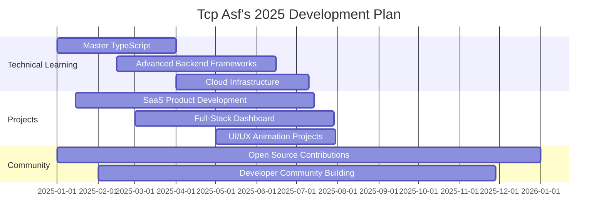

<h1 align="center">⚡ Tcp Asf ⚡</h1>
<h3 align="center">🧠 Full-stack Developer | 🕹️ Scripter | 🎮 Gamer | 🇩🇿 Algeria</h3>

<p align="center">
  
</p>

<div align="center">
  
  
  
</div>

---

## 🧬 Developer DNA

```javascript
const tcpAsf = {
  location: "Algeria 🇩🇿",
  specialty: ["Full-Stack", "Discord Bots", "FiveM Scripts"],
  languages: ["JavaScript", "Lua", "Python", "TypeScript"],
  frontend: ["HTML", "CSS", "React", "Tailwind CSS"],
  backend: ["Node.js", "Express", "MongoDB", "SQLite"],
  tools: ["Git", "GitHub", "VS Code", "Figma", "Bash"],
  currentFocus: "Building scalable solutions & automation tools",
  values: ["Consistency", "Problem Solving", "Community", "Craftsmanship"],
  contact: "alphaalberto79@gmail.com"
};
```

## 🚀 Expertise & Services

<table align="center">
  <tr>
    <td align="center">
      
      <br />JavaScript
    </td>
    <td align="center">
      
      <br />Node.js
    </td>
    <td align="center">
      
      <br />Discord Bots
    </td>
    <td align="center">
      
      <br />FiveM Scripts
    </td>
  </tr>
  <tr>
    <td align="center">
      
      <br />React
    </td>
    <td align="center">
      
      <br />MongoDB
    </td>
    <td align="center">
      
      <br />API Development
    </td>
    <td align="center">
      
      <br />Automation
    </td>
  </tr>
</table>

## 🔥 Featured Projects

<div align="center">
  <a href="https://github.com/tcpasf/KatibaNuker-V1.2">
    
  </a>
  <a href="https://github.com/tcpasf/RedEye-FivemStatus">
    
  </a>
</div>
<div align="center">
  <a href="https://github.com/tcpasf/Advanced-Discord-Bot-by-AlphaDev">
    
  </a>
</div>

## 📊 GitHub Analytics

<p align="center">
  
  
</p>
<p align="center">
  
</p>

<p align="center">
  
</p>

## 🛠️ Tech Stack & Tools

<p align="center">
  
</p>

## 🎯 2025 Development Roadmap



## 🧠 Dev Philosophy

> "Consistency beats motivation. Show up daily and build incrementally."

- **Code Like Poetry**: Write clean, readable, and maintainable code
- **Learn by Building**: Knowledge without application is wasted potential
- **Share Knowledge**: Contribute to the community that helped you grow
- **Solve Real Problems**: Focus on creating tools that solve genuine needs

## 📬 Connect With Me

<p align="center">
  <a href="mailto:alphaalberto79@gmail.com">
    
  </a>
  <a href="https://github.com/tcpasf">
    
  </a>
  <!-- Add your Discord or other social links here -->
</p>

---

<details>
  <summary>🖥️ <b>My Dev Environment</b></summary>

```bash
# 🧑‍💻 Terminal Specs
OS: Ubuntu 22.04 LTS / Windows 11
Terminal: Hyper with Oh-My-Zsh
Editor: VS Code with Dracula Theme
Extensions: ESLint, Prettier, GitHub Copilot
Shell: ZSH with custom aliases and functions
Browser: Firefox Developer Edition
Music: Lo-fi beats for peak concentration

# 🔄 Daily Routine
function daily() {
  git pull origin main
  npm update
  coffee_intake++
  create_something_useful()
  help_fellow_devs()
  commit_and_push()
  repeat()
}
```
</details>

<details>
  <summary>🎵 <b>Coding Playlist</b></summary>
  
  - Lo-fi beats
  - Synthwave
  - Epic Soundtracks
  - Ambient Electronica
  - Deep Focus playlists
</details>

<div align="center">
  
</div>
