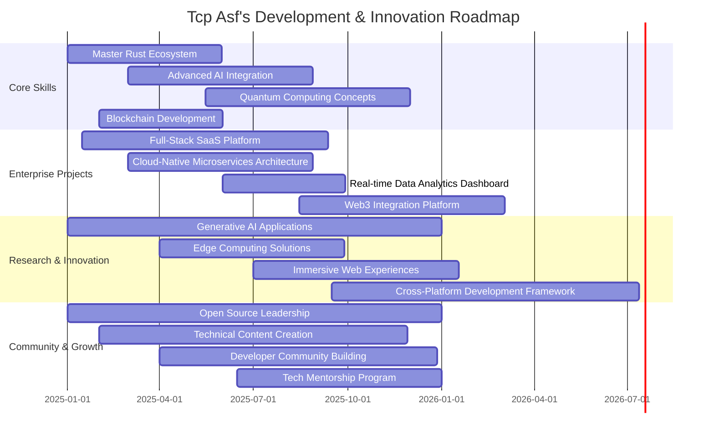

<!-- HEADER SECTION -->
<div align="center">
  

  <!-- TYPING SVG -->
  <a href="https://tcpasf-dzd.web.app/">
    
  </a>
  
  <!-- SOCIALS & STATS -->
  <div>
    <a href="https://tcpasf-dzd.web.app/" target="_blank">
      
    </a>
    <a href="mailto:tcpasf@thteam.me">
      
    </a>
    <a href="https://github.com/tcpasf">
      
    </a>
    <!-- Add other socials here -->
  </div>
  
  <div>
    
    
    
  </div>
</div>

<br />

<!-- ABOUT ME SECTION -->
## 👨‍💻 About Me | من أنا


```typescript
class TcpAsf implements Developer {
  name: string = "Tcp Asf";
  title: string = "Full-Stack Engineer & System Architect";
  location: string = "Algeria 🇩🇿";
  website: string = "https://tcpasf-dzd.web.app/";
  email: string = "tcpasf@thteam.me";
  
  expertiseAreas: string[] = [
    "Full-Stack Development",
    "System Architecture",
    "Discord Bot Development",
    "FiveM Script Engineering",
    "Automation Systems",
    "UI/UX Design"
  ];
  
  languages: Map<string, number> = new Map([
    ["JavaScript/TypeScript", 95],
    ["Python", 90],
    ["Lua", 92],
    ["Rust", 80],
    ["Go", 75],
    ["PHP", 85],
    ["C#", 78],
    ["Java", 72]
  ]);
  
  frameworks: string[] = [
    "React", "Next.js", "Vue.js", "Angular",
    "Node.js", "Express", "NestJS", "Django",
    "Flask", "Laravel", "ASP.NET Core"
  ];
  
  databases: string[] = [
    "MongoDB", "PostgreSQL", "MySQL", "Redis",
    "Firestore", "SQLite", "Supabase"
  ];
  
  devOps: string[] = [
    "Docker", "Kubernetes", "AWS", "Azure",
    "GitHub Actions", "CI/CD", "Terraform"
  ];
  
  currentFocus(): string {
    return "Building scalable cloud-native applications and AI-integrated systems";
  }
  
  lifePhilosophy(): string {
    return "Code, Create, Innovate, Repeat.";
  }
}
```

<br />

<!-- TECH STACK SECTION -->
## 🛠️ Tech Arsenal

<div align="center">
  <h3>Core Languages</h3>
  
  
  
  
  
  
  
  
</div>

<div align="center">
  <h3>Frontend Development</h3>
  
  
  
  
  
  
  
  
</div>

<div align="center">
  <h3>Backend & Infrastructure</h3>
  
  
  
  
  
  
  
  
</div>

<div align="center">
  <h3>Databases & Cloud</h3>
  
  
  
  
  
  
  
  
</div>

<div align="center">
  <h3>Tools & Environments</h3>
  
  
  
  
  
  
  
  
</div>

<br />

<!-- PROJECT SHOWCASE SECTION -->
## 🔥 Project Showcase

<div align="center">
  <table>
    <tr>
      <td width="50%">
        <h3 align="center">KatibaNuker V1.2</h3>
        <p align="center">
          <a href="https://github.com/tcpasf/KatibaNuker-V1.2" target="_blank">
            
          </a>
        </p>
        <p align="center">
          <strong>Advanced Discord server management tool with powerful administrative capabilities</strong>
        </p>
        <p align="center">
          
          
        </p>
      </td>
      <td width="50%">
        <h3 align="center">RedEye FiveM Status</h3>
        <p align="center">
          <a href="https://github.com/tcpasf/RedEye-FivemStatus" target="_blank">
            
          </a>
        </p>
        <p align="center">
          <strong>Real-time FiveM server monitoring system with advanced metrics and alerts</strong>
        </p>
        <p align="center">
          
          
          
        </p>
      </td>
    </tr>
    <tr>
      <td width="50%">
        <h3 align="center">Advanced Discord Bot</h3>
        <p align="center">
          <a href="https://github.com/tcpasf/Advanced-Discord-Bot-by-AlphaDev" target="_blank">
            
          </a>
        </p>
        <p align="center">
          <strong>Modular, extensible Discord bot with advanced features and command handling</strong>
        </p>
        <p align="center">
          
          
        </p>
      </td>
      <td width="50%">
        <h3 align="center">Coming Soon: AlphaDev Studio</h3>
        <p align="center">
          <a href="https://github.com/tcpasf" target="_blank">
            
          </a>
        </p>
        <p align="center">
          <strong>AI-powered development environment with code generation and optimization</strong>
        </p>
        <p align="center">
          
          
          
        </p>
      </td>
    </tr>
  </table>
</div>

<br />

<!-- GITHUB STATS SECTION -->
## 📊 GitHub Metrics

<div align="center">
  
  
</div><br>

<div align="center">
  
  
</div>

<div align="center">
  <a href="https://github.com/tcpasf">
    
  </a>
</div>

<br />

<!-- DEVELOPMENT ROADMAP SECTION -->
## 🛣️ Development Roadmap 2025-2026

<div align="center">
  
</div>



<br />

<!-- SERVICES SECTION -->
## 💼 Professional Services

<div align="center">
  <table>
    <tr>
      <td align="center">
        
        <br />
        <h3>Custom Development</h3>
        <p>End-to-end solutions tailored to your specific business needs</p>
      </td>
      <td align="center">
        
        <br />
        <h3>Discord Bot Development</h3>
        <p>Advanced, scalable Discord bots with custom functionality</p>
      </td>
      <td align="center">
        
        <br />
        <h3>Automation Systems</h3>
        <p>Workflow automation to increase efficiency and reduce manual tasks</p>
      </td>
    </tr>
    <tr>
      <td align="center">
        
        <br />
        <h3>API Development</h3>
        <p>Secure, fast, and reliable APIs for your applications</p>
      </td>
      <td align="center">
        
        <br />
        <h3>FiveM Development</h3>
        <p>Custom scripts and systems for FiveM roleplay servers</p>
      </td>
      <td align="center">
        
        <br />
        <h3>Cloud Solutions</h3>
        <p>Scalable cloud architecture design and implementation</p>
      </td>
    </tr>
  </table>
</div>

<div align="center">
  <h3>🔗 <a href="https://tcpasf-dzd.web.app/">Visit My Portfolio</a> for more details on services and projects</h3>
</div>

<br />

<!-- CODE SNIPPETS SECTION -->
## 👨‍💻 Code Wisdom

<div align="center">
  <table>
    <tr>
      <td>
        <h3>Elegant React Custom Hook</h3>
        
```typescript
import { useState, useEffect } from 'react';

interface UseFetchOptions {
  headers?: HeadersInit;
  cache?: RequestCache;
}

export function useFetch<T>(url: string, options?: UseFetchOptions) {
  const [data, setData] = useState<T | null>(null);
  const [error, setError] = useState<Error | null>(null);
  const [loading, setLoading] = useState<boolean>(true);

  useEffect(() => {
    const controller = new AbortController();
    const signal = controller.signal;

    const fetchData = async () => {
      try {
        setLoading(true);
        const response = await fetch(url, {
          signal,
          headers: options?.headers,
          cache: options?.cache || 'default',
        });

        if (!response.ok) {
          throw new Error(`HTTP error! Status: ${response.status}`);
        }

        const result = await response.json();
        setData(result);
        setError(null);
      } catch (err) {
        if (err.name !== 'AbortError') {
          setError(err instanceof Error ? err : new Error(String(err)));
          setData(null);
        }
      } finally {
        setLoading(false);
      }
    };

    fetchData();

    return () => controller.abort();
  }, [url, options?.cache, JSON.stringify(options?.headers)]);

  return { data, error, loading };
}
```
      </td>
      <td>
        <h3>Advanced Discord.js Command Handler</h3>
        
```javascript
const fs = require('fs');
const path = require('path');
const { Client, Collection, GatewayIntentBits } = require('discord.js');
const { token } = require('./config.json');

class CommandHandler {
  constructor(client) {
    this.client = client;
    this.client.commands = new Collection();
    this.client.cooldowns = new Collection();
    this.commandFolders = [];
  }

  async registerCommands(commandsPath) {
    // Find all command folders
    this.commandFolders = fs.readdirSync(commandsPath);
    
    for (const folder of this.commandFolders) {
      // Read all command files in each folder
      const folderPath = path.join(commandsPath, folder);
      const commandFiles = fs.readdirSync(folderPath)
        .filter(file => file.endsWith('.js'));
      
      for (const file of commandFiles) {
        const filePath = path.join(folderPath, file);
        const command = require(filePath);
        
        // Set command to collection
        if ('data' in command && 'execute' in command) {
          this.client.commands.set(command.data.name, command);
          console.log(`Registered command: ${command.data.name}`);
        } else {
          console.warn(`Command at ${filePath} is missing required properties`);
        }
      }
    }
  }

  setupEventListeners(eventsPath) {
    const eventFiles = fs.readdirSync(eventsPath)
      .filter(file => file.endsWith('.js'));
      
    for (const file of eventFiles) {
      const filePath = path.join(eventsPath, file);
      const event = require(filePath);
      
      if (event.once) {
        this.client.once(event.name, (...args) => event.execute(...args));
      } else {
        this.client.on(event.name, (...args) => event.execute(...args));
      }
      
      console.log(`Registered event: ${event.name}`);
    }
  }
}

// Client initialization
const client = new Client({ 
  intents: [
    GatewayIntentBits.Guilds,
    GatewayIntentBits.GuildMessages,
    GatewayIntentBits.MessageContent,
    GatewayIntentBits.GuildMembers
  ] 
});

// Setup command handler
const handler = new CommandHandler(client);
handler.registerCommands(path.join(__dirname, 'commands'));
handler.setupEventListeners(path.join(__dirname, 'events'));

// Login
client.login(token);
```
      </td>
    </tr>
  </table>
</div>

<br />

<!-- METRICS & PRINCIPLES SECTION -->
## 🧠 Development Philosophy

<div align="center">
  
</div>

<div align="center">
  <table>
    <tr>
      <td align="center" width="33%">
        <h3>🏗️ Code Craftsmanship</h3>
        <p>"Code should be clean, elegant, and readable. Every function should do one thing well."</p>
      </td>
      <td align="center" width="33%">
        <h3>🔄 Continuous Learning</h3>
        <p>"Learning is not a destination but a journey. Adapt, evolve, and improve daily."</p>
      </td>
      <td align="center" width="33%">
        <h3>🔍 Problem-First Approach</h3>
        <p>"Understand the problem deeply before attempting to solve it. Context matters."</p>
      </td>
    </tr>
    <tr>
      <td align="center" width="33%">
        <h3>🤝 Collaborative Growth</h3>
        <p>"Share knowledge freely. Learn from others and help them grow."</p>
      </td>
      <td align="center" width="33%">
        <h3>⚡ Performance Matters</h3>
        <p>"Build for scale from day one. Optimize critical paths and user experiences."</p>
      </td>
      <td align="center" width="33%">
        <h3>👁️ User-Centric Design</h3>
        <p>"Software exists to solve human problems. Always design with users in mind."</p>
      </td>
    </tr>
  </table>
</div>

<br />

<!-- TERMINAL SECTION -->
<details>
  <summary><h2>🖥️ Developer Environment</h2></summary>
  
```bash
$ tcpasf --version
Tcp Asf v3.5.2 - Full-Stack Developer & System Architect

$ tcpasf --system-info
OS: Arch Linux / Windows 11 (Dual Boot)
Terminal: Alacritty with Oh My Zsh + Powerlevel10k
Shell: ZSH with custom plugins
Editor: Neovim + VSCode with custom keybindings
Theme: Tokyo Night / Dracula Pro
Font: JetBrains Mono Nerd Font Ligaturized
Hardware: AMD Ryzen 9 5900X, 32GB RAM, RTX 3080
Monitor Setup: Dual 4K 144Hz Ultrawide

$ tcpasf --workflow
🔰 Version Control: Git with GitHub Flow
🔄 CI/CD: GitHub Actions + Custom Pipelines
📦 Containerization: Docker + Kubernetes
💻 Design: Figma + Excalidraw
📚 Documentation: Obsidian + GitBook
📊 Project Management: Linear + Notion
🧪 Testing: Jest + Cypress + Playwright

$ tcpasf --dev-schedule
05:00 - 06:00 | Learning new technologies
06:00 - 08:00 | Deep work on priority projects
08:00 - 09:00 | Exercise & Breakfast
09:00 - 12:00 | Client projects & collaboration
12:00 - 13:00 | Lunch & quick research
13:00 - 16:00 | Main development work & coding sessions
16:00 - 17:00 | Code reviews & documentation
17:00 - 18:00 | Open source contributions
18:00 - 19:00 | Dinner & Break
19:00 - 21:00 | Personal projects & experimentation
21:00 - 22:00 | Reading tech articles & planning tomorrow
22:00 - 05:00 | Rest & recharge

$ tcpasf --productivity-tips
🔥 Use Pomodoro technique (25 min focused work, 5 min break)
🧠 Practice active recall and spaced repetition for learning
⚡ Automate repetitive tasks with custom scripts
📝 Document everything - your future self will thank you
🛠️ Create reusable components and modules whenever possible
🔄 Continuous improvement over perfection
🎯 Focus on one primary task at a time
🧪 Test early, test often

$ tcpasf --quote
"The best code is the code that never needs to be written. The second best is the code that's so clear and elegant, it's self-documenting."
